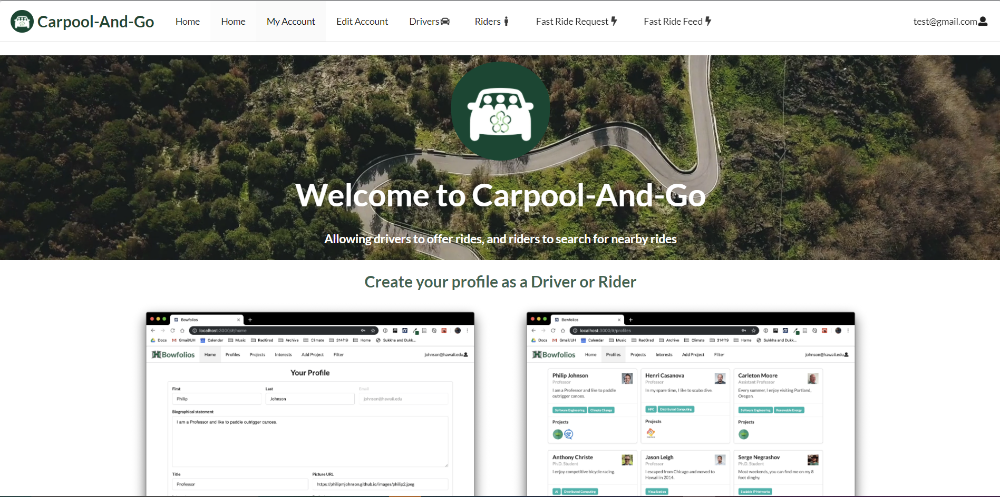
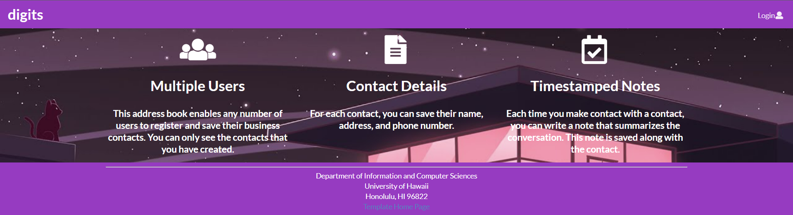
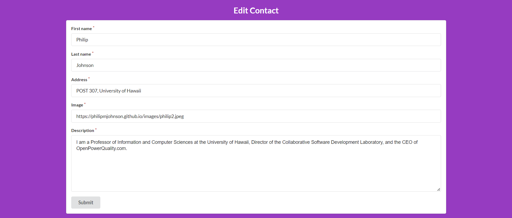
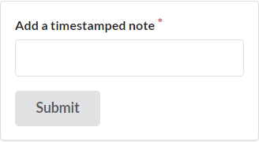
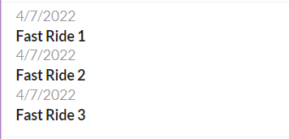

# Welcome to Carpool and Go!

## Table of contents
* [Group Member Agreement](#group-member-agreement)
* [Overview](#overview)
* [Project Goals](#project-goals)
* [Touring the Interface](#touring-the-interface)
* [What the system Should Eventually Provide](#what-the-system-should-eventually-provide)
* [Development Mockup Pages](#development-mockup-pages)
* [Development History](#development-history)

## Group Member Agreement
This web application is made in cooperation with Kenji Sanehira, Cory Parker, Robin Dumlao, Michael Ito, Johanan Leoncio, and Kai Sequeira.

For more information on the creation and the distribution of work, to contribute as a team, you can check [here.](https://docs.google.com/document/d/1YAd3LihnKsh5QRUVU11w1N1Rn5ffM7UGuOMRcv6_smM/edit?usp=sharing)

## Overview
Carpool and Go! is a web application project mockup that aims to provide a communal network for University of Hawaii at Manoa, allowing for drivers to offer rides and for riders to be able to search for rides in their area. This application is created by ICS software engineering students through the means of:

## Project Goals
Our goal with this project is to take in what we have learned over the course of the semester to create a functioning meteor application that reflects the teachings as well as the creative freedoms we get to choose while creating this project. By working together in a team environment, we aim to gain experience as well as further our practice in web design. Also, by creating a mockup for a service in an attempt to combat a real world problem, we hope to be able to translate this problem solving into other scenarios in real world applications.

## Touring the Interface
As we progress and further develop the website application, we will be showing the different aspects of our website and pages here. This is where the final product and how to navigate through the website will go. Currently there is nothing yet, but stay tuned!

    Pages (WIP) //this will be describing what users see when they first enter the
    website, how to create an account, what can they do after, etc.

## What the System Should Eventually Provide
What this system should eventually provide is a website service that allows University of Hawaii at Manoa students and staff the ability to have access to get to school with having less cars needed to traverse the roads. Users who log in can either look to offer rides, or search for possible drivers that they can catch a ride with to campus. By offering this service, we hope to do our part to help against the rising gas prices and heavy traffic near the University.

## Development Mockup Pages
This section will show how the website looks like during each stage of the development. Since it is very early in the stages, some of the mockups simply show structure based on other well known meteor projects to show what our website pages will eventually look like. Different from [touring the interface,](#touring-the-interface) this section will show the changes of these website pages over time, rather than the end result.

### Landing Page
The landing page will contain a general description of what Carpool and Go aims to accomplish:

### General Home Page
The general home page will look similar to digits, in that it contains three columns that describe the specific functions of the site:
* Drivers
* Riders
* FastRide

This can be implemented similarly to the digits home page, which is depicted below:

### User Profile Page
The user profile page will be a large card that contains all of the fields required of the user when they log in. At the bottom of this card will be an edit section, which the user can click on that will take them to the "User Profile Edit Form".
This can be implemented similarly to the digits contact card, which is depicted below:

### User Profile Edit Form
The user profile edit form will be a form that contains all of the fields required of the user when they log in. It will change only the data of the current user logged in, and upon submitting, will change the users data in the user collection and the users data in the User Profile Page.
This is similar to many of the edit forms we have developed for this class, an example of which is depicted below:

### Drivers/Riders Page
The Drivers/Riders Pages will be nearly identical in structure, but will differ in the data they display. The Drivers page will show exclusively drivers whereas the riders will only show riders. The top of the page will contain a filter container that allows the user to sort by location.
This is similar to the filter feature shown in the bowfolios application, an example of which is shown here:

### "Fast Ride" Feed
The "Fast Ride" feed page will be a feed that consists of all of the requested Fast rides sent by the Fast Ride Form. The feed will display the user's Profile Picture, their first and last name, and then the rest of the information gathered from the fast rides form.
This is similar to the digits notes feed shown below:

### "Fast Ride" Form
The "Fast Ride" form page will be a form that allows a user to request a ride to a specific location at a particular time of day. It will send data to the "Fast Ride" feed.
This is similar to the digits notes form shown below:

## Development History
Milestones are important! This project undergoes the developmental process practices in order to create a fully functioning meteor proof-of-concept prototype. This section is dedicated to keeping track of milestone goals and how we managed to achieve them.
